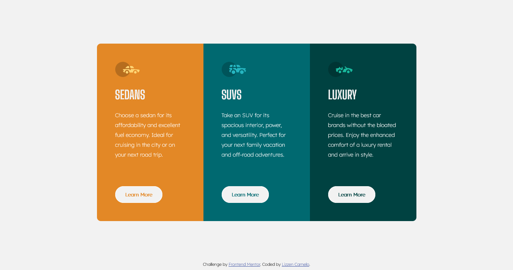

# Frontend Mentor - 3-column preview card component solution

This is a solution to the [3-column preview card component challenge on Frontend Mentor](https://www.frontendmentor.io/challenges/3column-preview-card-component-pH92eAR2-). Frontend Mentor challenges help you improve your coding skills by building realistic projects. 

## Table of contents

  - [The challenge](#the-challenge)
  - [Screenshot](#screenshot)
  - [Links](#links)
- [My process](#my-process)
  - [Built with](#built-with)

### The challenge

Users should be able to:

- View the optimal layout depending on their device's screen size
- See hover states for interactive elements

### Screenshot

### Links

- Solution URL: [Click here] (https://www.frontendmentor.io/solutions/responsivehtmlandcsspreviewcardcomponentwithcssflexbox-67z5i2uiA)
- Live Site URL: [https://lizzencamelo.github.io/Responsive-HTML-and-CSS-Preview-Card-Component/]

## My process

Creating an efficient responsive layout was my main focus with this minor project. CSS flexbox and media queries were first implemented followed by styling the website.

### Built with

- Semantic HTML5 markup
- CSS custom properties
- Flexbox
- Mobile-first workflow
- Media queries
